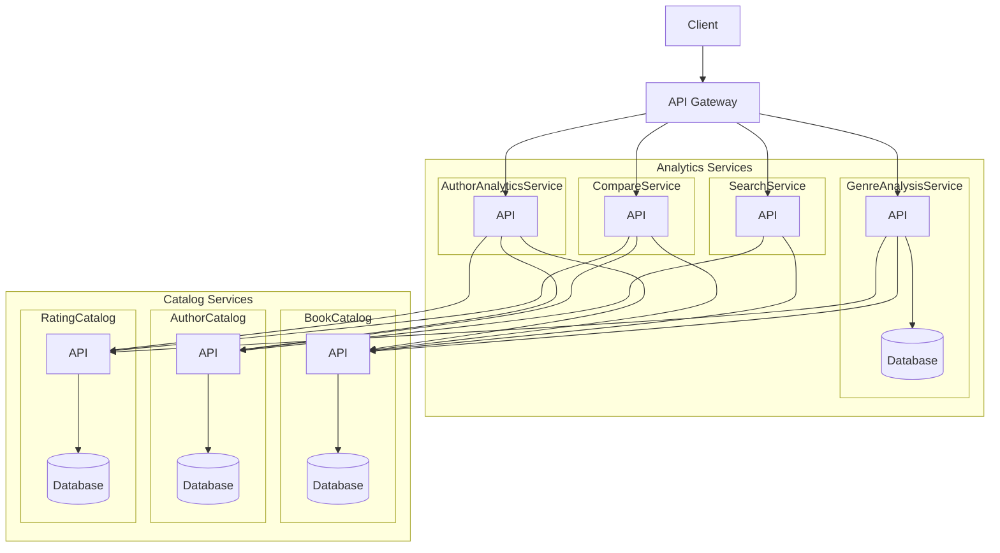

# Phase 3 – Functional Requirements and Application Architecture
Group 2

## 1. Functional Requirements

### Service 1

#### FR1 – 

##### Description

##### Inputs

##### Processing

##### Outputs

---

#### FR2 – 

##### Description

##### Inputs

##### Processing

##### Outputs

## 2. Application Architecture

### 2.1 System Components

### 2.2 Component Responsibilities

#### Microservices

#### Database

--

## 3. Application Architecture Diagram

